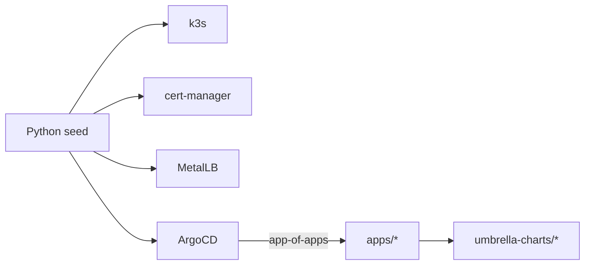

# k3s Workstation Platform

Reproducible, GitOps-managed Kubernetes base platform for an AI-oriented workstation on WSL2 and k3s.

A small imperative seed bootstraps the cluster. ArgoCD then runs everything else from git.

This repository is the generic base platform layer.

## How it works

The model is simple:

1. A tiny Python seed installs the bare minimum ArgoCD needs to start.
2. ArgoCD takes over and reconciles the rest from git, through an app-of-apps.
3. Renovate proposes updates. They flow through gitflow and ship as pinned releases.

The seed installs only three charts: cert-manager, MetalLB and ArgoCD. k3s provides the flannel CNI.

Those three charts are not special. They live in `umbrella-charts/`, like every other workload. Once
ArgoCD is up, it adopts and reconciles the very same charts. Nothing stays outside GitOps.



## Requirements

- `uv` for the Python project.
- A Linux host with systemd active. WSL2 with systemd enabled is the design target.
- `sudo` access. k3s and the CLI tools install system-wide.

Only `uv` must be present up front. The bootstrap installs everything else: kubectl, helm, sops, age
and step (pinned in `tool-versions.yaml`), plus k3s.

## Quickstart

Install the prerequisites and clone the repository:

```bash
sudo apt-get update && sudo apt-get install -y git curl
curl -LsSf https://astral.sh/uv/install.sh | sh
source $HOME/.local/bin/env
git clone https://github.com/forterro/k3s-workstation-platform.git
cd k3s-workstation-platform
```

Create the environment and deploy:

```bash
uv sync                                                 # locked environment
uv run k3s-workstation-bootstrap preflight              # check host and tooling
uv run k3s-workstation-bootstrap bootstrap --dry-run    # preview, no changes
uv run k3s-workstation-bootstrap bootstrap              # deploy
```

The bootstrap mutates the machine it runs on. Run it on the target workstation.

## What the bootstrap does

First it prepares the host:

1. Installs missing or outdated CLI tools into `/usr/local/bin` (sudo).
2. Generates a local age key for SOPS if none exists.

Then it runs the seed phases in order:

1. Installs and starts k3s. Traefik and the built-in servicelb are disabled.
2. Enables the NVIDIA GPU runtime for k3s when a GPU is present (installs the NVIDIA Container
   Toolkit and restarts k3s so containerd exposes the `nvidia` runtime). A no-op without a GPU.
3. Installs cert-manager.
4. Generates the local CA on first run and applies its ACME `ClusterIssuer`.
5. Installs ArgoCD (with the KSOPS secrets plugin).
6. Installs MetalLB and pins the Traefik LoadBalancer IP.
7. Generates the local Grafana admin password on first run and applies the `grafana-admin` secret.
8. Installs the ArgoCD root app-of-apps.

From there, ArgoCD tracks the git repository set in `rootApp` (see
[bootstrap/helm/root-app/values.yaml](bootstrap/helm/root-app/values.yaml)) and reconciles the child
Applications under `apps/`.

## Verify the install

The k3s kubeconfig is written to `/etc/rancher/k3s/k3s.yaml`:

```bash
export KUBECONFIG=/etc/rancher/k3s/k3s.yaml

kubectl get nodes                        # the node should be Ready
kubectl -n argocd get applications       # all Synced and Healthy
kubectl -n traefik get svc traefik       # EXTERNAL-IP is the fixed LoadBalancer IP
```

## Open the ArgoCD UI

Read the initial admin password, then port-forward the server:

```bash
kubectl -n argocd get secret argocd-initial-admin-secret \
  -o jsonpath='{.data.password}' | base64 -d; echo
kubectl -n argocd port-forward svc/argocd-server 8080:443
```

Open `https://localhost:8080` and log in as `admin`.

Once DNS is set up (see below), the UI is also reachable at
`https://argocd.workstation.internal`.

## Open Grafana

Observability is a metrics-only stack built on the Prometheus Operator (kube-prometheus-stack):
Prometheus, Grafana and the node/kube-state exporters. Any component registers itself by shipping a
`ServiceMonitor`/`PodMonitor` (discovered cluster-wide) and its Grafana dashboards as ConfigMaps
labelled `grafana_dashboard=1` (auto-loaded from any namespace).

The bootstrap generates a stable Grafana admin password on first run, stores it locally under
`~/.k3s-workstation-platform/grafana/admin-password` (never committed to git) and publishes it as the
`grafana-admin` secret that Grafana consumes via `admin.existingSecret`. Read it from either source:

```bash
cat ~/.k3s-workstation-platform/grafana/admin-password

# or from the cluster secret
kubectl -n observability get secret grafana-admin \
  -o jsonpath='{.data.admin-password}' | base64 -d; echo
```

Once DNS is set up (see below), open `https://grafana.workstation.internal` and log in as `admin`.

## Certificates

- The platform runs its own ACME certificate authority, step-ca. cert-manager issues the certs.
- The CA material lives under `~/.k3s-workstation-platform/ca`. It is never committed to git.
- The bootstrap generates it on first run, then applies the CA ConfigMaps, Secrets and the ACME
  `ClusterIssuer`. The step-ca workload consumes them.
- Rotate the CA with `FORCE=1 make generate-ca`.

## Extra layers

The base platform can hand ArgoCD extra root app-of-apps that live in sibling repositories, so a
layer built on top (for example an AI stack) reconciles independently without the base code
referencing it. Declare them under `extra_root_apps` in `~/.k3s-workstation-platform/config.yaml`:

```yaml
extra_root_apps:
  - name: ai-platform
    path: ../ai-workstation-platform/bootstrap/helm/root-app
```

Each `path` is a Helm chart directory resolved relative to this repository's root (a sibling
submodule is reachable as `../<repo>/...`). The `extra-root-apps` phase installs each chart into the
`argocd` namespace after the base root app. The list defaults to empty.

## Local access

How access works:

- Every service lives under `*.workstation.internal`.
- Services share one Traefik LoadBalancer IP and differ only by HTTP host. One wildcard record
  covers them all.
- servicelb (klipper) is disabled. MetalLB (L2 mode) pins Traefik to a fixed IP.
- The IP is stored as `loadbalancer_ip` in `~/.k3s-workstation-platform/config.yaml`.
- In-cluster, CoreDNS already resolves the domain to Traefik (this covers the ACME http-01
  challenge).

### Set the LoadBalancer IP

- The bootstrap prompts for it on first run.
- Pick a free address inside the WSL2 NAT subnet, in the same range as the node `eth0` (for example
  `172.17.47.200`).
- The subnet can move after an HNS reset. Re-check the IP if resolution breaks.

```bash
# during bootstrap
uv run k3s-workstation-bootstrap bootstrap --loadbalancer-ip 172.17.47.200

# later (re-pins the pool and restarts Traefik)
uv run k3s-workstation-bootstrap set-loadbalancer-ip 172.17.47.200
```

### Reach it from Windows

One-time, Windows-side setup. Nothing runs in the cluster for it.

- Keep the default WSL2 NAT networking. Do not enable mirrored mode.
- In NAT the MetalLB address is reachable from Windows, with no shared port 53 to fight over.

**1. Find the Traefik IP**

- It equals the `loadbalancer_ip` you configured.
- Do not use `127.0.0.1`. MetalLB announces the address on the node interface, so only that IP
  answers on 80/443.
- The IP survives `wsl --shutdown`, but must stay in the WSL2 NAT subnet. After an HNS reset, run
  `set-loadbalancer-ip` with a new address and update Acrylic.

```bash
KUBECONFIG=/etc/rancher/k3s/k3s.yaml kubectl -n traefik get svc traefik \
  -o jsonpath='{.status.loadBalancer.ingress[0].ip}'; echo
```

**2. Point Acrylic DNS at it**

- Install [Acrylic DNS Proxy](https://mayakron.altervista.org/support/acrylic/Home.htm). It supports
  wildcards; the Windows hosts file does not.
- Add a wildcard entry to `AcrylicHosts.txt`:

  ```text
  172.17.47.200 *.workstation.internal
  ```

- Bind Acrylic to the loopback in `AcrylicConfiguration.ini`:

  ```ini
  LocalIPv4BindingAddress=127.0.0.1
  ```

- This binding is required. WSL2 NAT uses the Windows ICS service (`SharedAccess`), which already
  holds `0.0.0.0:53` on IPv4. On `0.0.0.0`, Acrylic wins only IPv6 UDP 53, so IPv4 queries to
  `127.0.0.1` hit ICS and get no answer. Binding `127.0.0.1` specifically wins loopback traffic.
- Restart the service: `Restart-Service AcrylicDNSProxySvc -Force`.

**3. Route the suffix to Acrylic**

- Add an NRPT rule (PowerShell as administrator). The rest of your DNS is untouched:

  ```powershell
  Add-DnsClientNrptRule -Namespace ".workstation.internal" -NameServers "127.0.0.1"
  ```

- Verify:

  ```powershell
  Get-NetUDPEndpoint -LocalPort 53 | Select-Object LocalAddress, OwningProcess  # 127.0.0.1 -> Acrylic
  nslookup toto.workstation.internal 127.0.0.1                                   # -> the Traefik IP
  Resolve-DnsName headlamp.workstation.internal                                  # via the NRPT rule
  ```

**4. Trust the CA root**

- Needed so certificates validate (PowerShell as administrator).
- Copy the root from `\\wsl$\<distro>\home\<you>\.k3s-workstation-platform\ca\root_ca.crt`, then:

  ```powershell
  Import-Certificate -FilePath root_ca.crt -CertStoreLocation Cert:\LocalMachine\Root
  ```

Once the Headlamp certificate is issued, open `https://headlamp.workstation.internal` from Windows.

## Reset the cluster

Remove k3s and its cluster from the distribution, without discarding the distribution:

```bash
uv run k3s-workstation-bootstrap reset
```

This is handy to re-run the bootstrap from a clean state.

## Test in a disposable environment

The bootstrap is destructive to the host. Test it safely in a throwaway environment.

On WSL2, import the latest Ubuntu LTS as a named distribution and discard it afterwards:

```powershell
wsl.exe --install Ubuntu-26.04
wsl -d Ubuntu-26.04
# enable systemd, then restart the distro:
#   printf '[boot]\nsystemd=true\n' | sudo tee /etc/wsl.conf
#   wsl --shutdown
# run the quickstart inside, then discard everything:
wsl --unregister Ubuntu-26.04
```

On a non-WSL Ubuntu host, Canonical Multipass gives a throwaway VM (`multipass launch`,
`multipass delete --purge`).

## Repository layout

```text
pyproject.toml  uv.lock  Makefile
tool-versions.yaml           # pinned CLI tool versions
src/workstation_bootstrap/   # imperative seed generator
bootstrap/helm/root-app/     # ArgoCD app-of-apps entrypoint (the only seed-only chart)
umbrella-charts/             # single source of truth: every workload chart (seed-installed + GitOps)
apps/                        # child ArgoCD Applications reconciled by the root app-of-apps
secrets/                     # SOPS-encrypted secrets rendered by the KSOPS plugin
scripts/                     # operational scripts (CA generation)
config/                      # optional local value overrides
```

## Development

```bash
make sync      # uv sync (runtime + dev)
make lint      # ruff check
make format    # ruff format
make test      # pytest
```

## License

Apache License 2.0. See [LICENSE](LICENSE).

## Roadmap

- CI workflows (gitflow, quality gates, changelog gate) land in a dedicated increment.
