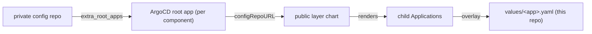

# The private per-workstation config repository

The base platform is generic and public. Everything user-specific or machine-specific lives in a
separate, **private** repository that composes the public layers. This document explains what that
repo contains and how to create one from scratch.

The repositories involved:

| Repository | Visibility | Role |
| --- | --- | --- |
| `k3s-workstation-platform` | public | Reproducible base (infra + bootstrap engine). This repo. |
| `ai-workstation-platform` | public | GPU serving extension (Ollama / vLLM / DCGM / LiteLLM). |
| **your config repo** | **private** | Secrets, toggles, value overrides, bootstrap config. |

The public repos never reference the private one. The private repo points at them. This keeps the
base reproducible and shareable while your machine's IPs, models, passwords and secrets stay private.

## What the private repo contains

```text
workstation-config/
  config.yaml            # bootstrap consumer config (IP, platform repo, config repo, components)
  .sops.yaml             # SOPS/age encryption policy for secrets/
  .gitignore             # excludes the local-only root of trust
  values/                # per-workstation Helm value overlays (values/<app>.yaml)
    ollama.yaml
    vllm.yaml
    litellm.yaml
  secrets/               # SOPS-encrypted secrets (*.enc.yaml), decrypted by KSOPS in ArgoCD
  # local only, never committed (see .gitignore):
  ca/                    # workstation CA material (generated per host)
  grafana/               # generated Grafana admin password
```

The age private key lives outside the repo at `~/.config/sops/age/keys.txt`.

## Create one from scratch

### 1. Create an empty private repository

Create a private repository on your git host, for example
`https://git.example.com/<you>/workstation-config.git`, and clone it. The bootstrap expects to find it
(or clone it) at `~/.k3s-workstation-platform`, which is its config directory.

### 2. Generate the age key for SOPS

Secrets are encrypted with [SOPS](https://github.com/getsops/sops) and an age key. The bootstrap
generates one automatically if absent; to create it by hand:

```bash
mkdir -p ~/.config/sops/age
age-keygen -o ~/.config/sops/age/keys.txt
grep '^# public key:' ~/.config/sops/age/keys.txt   # note the age1... recipient
```

The private key stays local. The bootstrap publishes it to ArgoCD as the `sops-age` secret, where the
KSOPS plugin uses it to decrypt secrets at render time.

### 3. Add `.gitignore` for the local root of trust

Some material is the machine's root of trust and is regenerated per host. It must never be committed:

```gitignore
# Local root-of-trust and generated material, never commit these.
ca/
grafana/
root-app-values.yaml
*.bak*
config.yaml.bak*
```

### 4. Add `.sops.yaml`

Encrypt only the secret values so manifests stay readable in diffs. Use the age recipient from step 2:

```yaml
creation_rules:
  - path_regex: secrets/.*\.enc\.yaml$
    encrypted_regex: ^(data|stringData)$
    age: age1...your-public-key...
```

### 5. Write `config.yaml`

This is the bootstrap consumer config. It names the public base platform, this machine's LoadBalancer
IP, this private repo's own URL, and the optional layer components to deploy:

```yaml
platform_repo_url: https://github.com/<org>/k3s-workstation-platform.git
platform_revision: main
loadbalancer_ip: 172.17.47.200

# This workstation's private config repo. The bootstrap injects it into every component
# below as the configRepoURL Helm parameter, so the public layer charts pick up this
# repo's value overlays (values/<name>.yaml).
config_repo_url: https://git.example.com/<you>/workstation-config.git
config_repo_revision: main

# Optional components layered on top of the base platform. Each entry is a public layer
# chart; the bootstrap turns it into one ArgoCD Application (project + source + the
# injected configRepoURL). Leave the list empty to run the base platform standalone.
extra_root_apps:
  - name: 1-root-ai-workstation
    project: ai-workstation
    repo_url: https://github.com/<org>/ai-workstation-platform.git
    revision: main
    path: bootstrap/helm/layer
```

The `loadbalancer_ip` must be a free address inside the WSL2 NAT subnet. The bootstrap prompts for it
on first run if unset.

### 6. Add value overlays under `values/`

Each layer app reads an optional `values/<app>.yaml` overlay from this repo. This is where you enable
serving engines, pin models, and override chart defaults per machine. The AI layer overlays
(`ollama.yaml`, `vllm.yaml`, `litellm.yaml`) are documented in the AI serving layer repo, under
`docs/private-config-repo.md`.

### 7. Add encrypted secrets under `secrets/`

Application secrets go under `secrets/` as `*.enc.yaml`, encrypted with SOPS per `.sops.yaml`. The
KSOPS plugin in the ArgoCD repo-server decrypts them at render time using the `sops-age` secret.

## Wire it into the bootstrap

On first run, pass `--config-repo` so the bootstrap clones the private repo into
`~/.k3s-workstation-platform`:

```bash
uv run k3s-workstation-bootstrap bootstrap \
  --config-repo https://git.example.com/<you>/workstation-config.git
```

Afterwards the URL is read from `config.yaml` (`config_repo_url`) and the repo is kept in sync on each
run. Both `config_repo_url` and `extra_root_apps` default to empty, so the base platform runs
standalone when no private repo is supplied.

## How composition works

The `extra-root-apps` phase runs after the base app-of-apps. For each `extra_root_apps` entry it:

1. Seeds an ArgoCD repository credential for the private config repo (taken from the git credential
   helper), so ArgoCD can read a private source.
2. Creates the ArgoCD `project`.
3. Applies one ArgoCD `Application` pointing at the public layer chart (`repo_url` + `path`), injecting
   this repo's URL as the `configRepoURL` Helm parameter.

The layer chart renders one child `Application` per brick. When `configRepoURL` is set, apps flagged
`overlay` become multi-source: the public chart plus this repo's `values/<app>.yaml`. When it is
empty, they render standalone from public chart defaults only.



## Local root of trust (never committed)

These stay local only (excluded in `.gitignore`) and are regenerated per host:

- `ca/`: the workstation CA material. Generated on first run; rotate with `FORCE=1 make generate-ca`.
- `grafana/admin-password`: the generated Grafana admin password.
- `~/.config/sops/age/keys.txt`: the age private key (outside this directory).

## See also

- Base platform config-repo mechanics: the "Extra layers" section of the [README](../README.md).
- AI layer overlays and components: `docs/private-config-repo.md` in the `ai-workstation-platform`
  repository.
